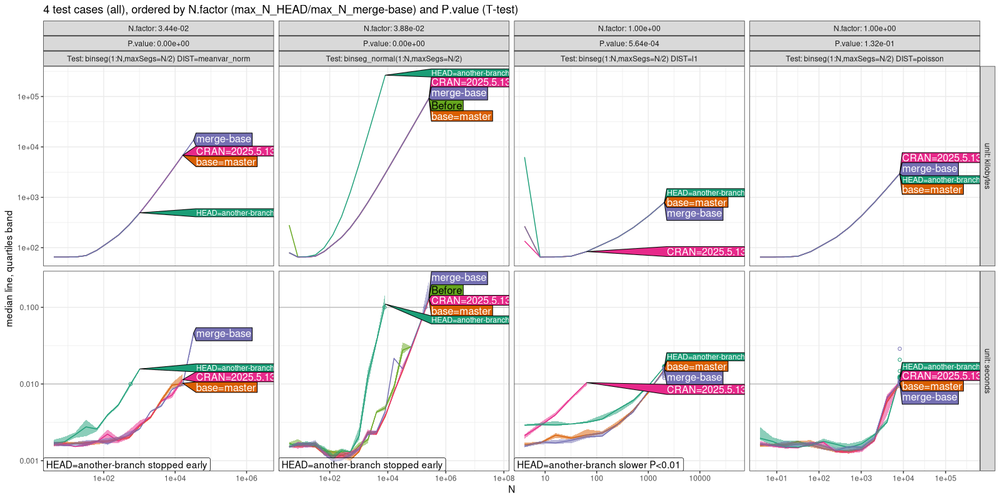

<!--
%\VignetteEngine{litedown::vignette}
%\VignetteIndexEntry{Continuous integration testing}
-->

In this vignette, we show how to use atime for continuous integration
testing. We begin by cloning a github repository of an R package which
already has atime CI code.

```{r}
tdir <- tempfile()
dir.create(tdir)
git2r::clone("https://github.com/tdhock/binsegRcpp", tdir)
repo <- git2r::repository(tdir)
git2r::checkout(repo, branch="another-branch")
```

The code below is the atime test suite of the binsegRcpp package:

```{r}
inst.atime <- file.path(tdir, "inst", "atime")
test.lines <- readLines(file.path(inst.atime, "tests.R"))
cat(test.lines, sep="\n")
```

We can run the atime CI code in that package via:

```{r}
if(interactive()){
  options(repos="http://cloud.r-project.org")
  result.list <- atime::atime_pkg(tdir)
  file.path(inst.atime, "tests_all_facet.png")
}
structure("", class="knit_asis")
```

The figure above shows four columns of panels from left to right, one
for each test defined in the `binsegRcpp` package:

* For `DIST=meanvar_norm` we see `HEAD` has a **constant factor slowdown**,
  which you can see as a small difference for small `N`, and a constant
  amount of separation on the log-log plot for large `N` (slopes about
  the same, so same asymptotic time complexity class).
  This large difference is indicated by "stopped early" message.
* For `binseg_normal` we see `HEAD` has a **larger asymptotic complexity class**, for both time and memory, as can be seen by the larger slope
  (difference grows with `N`).
  This large difference is indicated by "stopped early" message.
* For `DIST=l1` we see `HEAD` has a **constant time slowdown**, which you
  can see because there is some difference for small `N`, but not much
  for larger `N` (timings about the same). In other words, the
  slowdown happens outside of a for loop over `N`.
  This small but significant difference is indicated by "slower P<0.01" message.
* For `DIST=poisson` there is no difference in computational
  requirements between the three versions (neither time nor memory).

The column panels are sorted so that the first one on the left is the
most likely to have a speed regression. In detail, 

* plots emphasize differences between `HEAD` and a comparison version, which is defined as the first of these versions which is available: `merge-base` (common ancestor of `HEAD` and `base`), `base` (typically `master` or `main`), `CRAN`.
* Plots show test cases, first sorted by `N.factor`, which is the ratio of `N` values at the time limit, `HEAD` versus comparison version.
* If `N.factor<1` then `HEAD` is much slower than comparison version (the smaller `N` value for `HEAD` went over the time limit).
* `N.factor=1` means `HEAD` and comparison version had same value for largest `N` (so have nearly the same speed).
* Ties are broken using `P.value`, un-paired two-sample T-test for `HEAD` time greater than comparison time at largest `N`.
